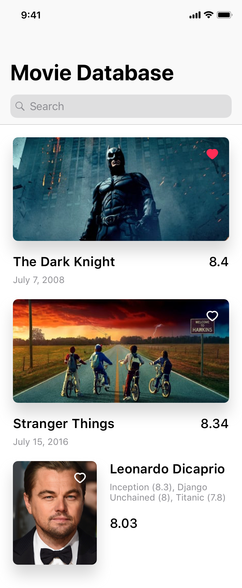

# Overview

The Movie Database app allows users to search for movies, tv shows, and actors. 

# How it works

The user's search query will search against the `movies`, `tv`, and `person` endpoints in **The Movie Database API**. The results are displayed in a single list in which the list is sorted in descending order by `vote_average`. The `Movie` and `TV` entities already contain a `vote_average` proeprty, but the vote average for the Person entity needs to be a calculated value. The calculation is the average `vote_average` of all entities in the `known_for` array.

# API

API Key: `c352da303cecea898250194bd5cc0dc5`

API Documentation: https://developers.themoviedb.org/3/getting-started/introduction

# Missing Requirements:
- Implement the vote average calculation for the `Person` entity.
- Implement the `knownFor` label
- Implement vote average sorting on search results
- Implement proper date formatting
- Implement unit tests